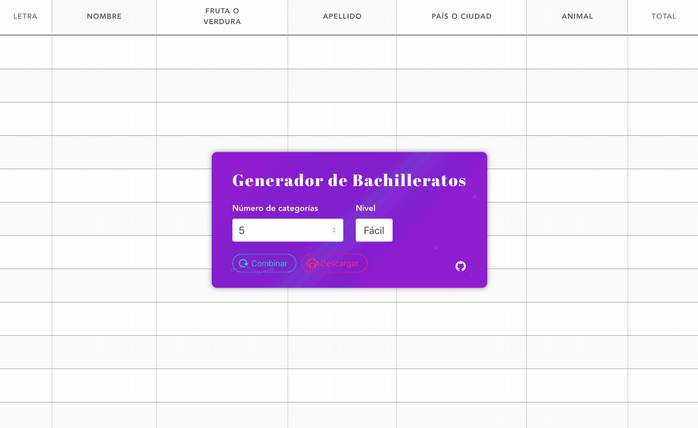

# Generador del juego Bachillerato
Generador de hojas para imprimir del famoso juego Bachillerato, Tutti fruttti, Basta, Stop, Alto el lápiz, o Mercadito.

## Features

* Hecho con Vue
* [Diccionario](https://github.com/raulghm/bachillerato/blob/master/src/data.json) de categorías por niveles
* Generación de grilla automatica
* Salida de archivos en el cliente, via canvas y pdf
* _De momento sólo funciona en desktop_, ya que toma las dimensiones del navegador para exportar a pdf

